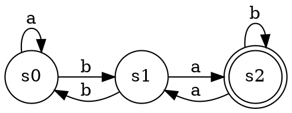

DFA is a Python library designed for creating and visualizing [deterministic finite automata](https://en.wikipedia.org/wiki/Deterministic_finite_automaton).

## Example

An automaton can be provided using [JSON](https://en.wikipedia.org/wiki/JSON):

```python
>>> automaton = DeterministicFiniteAutomaton('''
... {
...     "s0": {
...         "initial": true,
...         "edges": {
...             "a": "s0",
...             "b": "s1"
...         }
...     },
...     "s1": {
...         "edges": {
...             "a": "s2",
...             "b": "s0"
...         }
...     },
...     "s2": {
...         "final": true,
...         "edges": {
...             "a": "s1",
...             "b": "s2"
...         }
...     }
... }
... ''')
```

After construction, it exposes two methods:

```python
>>> sequence = "bababaaaabaaaa"
>>> automaton.accepts(sequence)
False
>>> automaton.longest_accepted_prefix(sequence)
'bababaaaaba'
```

## Visualization

The automaton can be rendered in the [DOT language](https://en.wikipedia.org/wiki/DOT_(graph_description_language)). Calling `automaton.draw(filepath='/tmp/dfa.gv')` will create two files: `/tmp/dfa.gv` and `/tmp/dfa.gv.png`:




## Requirements

DFA requires [`graphviz`](https://pypi.python.org/pypi/graphviz) in order to render the automata. It can be installed by running:

```sh
$ pip install graphviz
```
